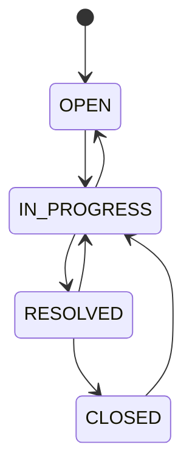

# Design: Ticket Status Transitions & Audit Trail

**Component:** `/service` (Spring Boot)
**Status:** Draft for implementation
**Related:** `docs/PLAN.md` (Phase 2)

---

## 1. Purpose & scope

Add two capabilities to the existing ticket service:

1. **Status-transition rules** — a ticket's `status` can only change along legal edges of a defined state machine. Illegal changes are rejected.
2. **Audit trail** — every *successful* status change is recorded as an immutable history entry (who, from, to, when), queryable per ticket.

This replaces any "set status to anything" behavior in the CRUD layer with a validated transition operation.

## 2. Non-goals

- No authentication/authorization (the actor is supplied in the request for now).
- No SLA timers, escalation, or notifications.
- No editing or deleting of audit entries (append-only by design).
- No workflow configuration UI — the state machine is defined in code.

## 3. Status model

States: `OPEN`, `IN_PROGRESS`, `RESOLVED`, `CLOSED`. New tickets start in `OPEN`.



Rationale for the notable edges:
- `IN_PROGRESS → OPEN` — return a ticket to the queue.
- `RESOLVED → IN_PROGRESS` — reopen when a resolution didn't hold.
- `CLOSED → IN_PROGRESS` — reopen a closed ticket (asymmetric: you may reopen a closed ticket, but you may **not** close an in-progress one directly — it must be resolved first).

## 4. Transition rules

Allowed (`✓`), forbidden (`✗`), self-transition not permitted (`—`):

| from ↓ / to → | OPEN | IN_PROGRESS | RESOLVED | CLOSED |
|---|:---:|:---:|:---:|:---:|
| **OPEN**        | — | ✓ | ✗ | ✗ |
| **IN_PROGRESS** | ✓ | — | ✓ | ✗ |
| **RESOLVED**    | ✗ | ✓ | — | ✓ |
| **CLOSED**      | ✗ | ✓ | ✗ | — |

Explicit forbidden examples worth testing:
- `OPEN → RESOLVED` and `OPEN → CLOSED` (can't resolve/close unworked tickets).
- `IN_PROGRESS → CLOSED` (must be resolved before closing).
- `RESOLVED → OPEN` (reopen goes through IN_PROGRESS, not back to the queue).
- Any state → itself (no-op transitions are rejected as invalid).

## 5. Invalid-transition behavior

- On an illegal transition: **reject**, leave the ticket unchanged, write **no** audit entry, return an error naming the current status and the allowed next states.
- On an unknown/malformed target status or missing actor: reject as a bad request.

## 6. Audit trail

Every successful transition appends one immutable entry.

Entry shape:
```json
{
  "id": "uuid",
  "ticketId": "uuid",
  "fromStatus": "OPEN",
  "toStatus": "IN_PROGRESS",
  "changedBy": "agent:jsmith",
  "changedAt": "2026-07-01T14:03:22Z",
  "note": "starting work"    // optional, may be null
}
```

Rules:
- Written **only** on successful transitions (rejected attempts are not recorded).
- Append-only: entries are never updated or deleted.
- `changedAt` is server-set (ISO-8601, UTC).
- Retrievable in chronological order per ticket.

## 7. API surface

### Change status
`PATCH /api/tickets/{id}/status`

Request:
```json
{ "toStatus": "IN_PROGRESS", "changedBy": "agent:jsmith", "note": "starting work" }
```

Responses:
- `200 OK` — updated ticket (with new status).
- `409 Conflict` — illegal transition; body includes `currentStatus` and `allowedNext` (array).
- `400 Bad Request` — unknown status value or missing `changedBy`.
- `404 Not Found` — no ticket with that id.

### Get history
`GET /api/tickets/{id}/history`

Responses:
- `200 OK` — array of audit entries in chronological order.
- `404 Not Found` — no ticket with that id.

## 8. Domain design guidance

- **Single source of truth for the state machine.** Encode the allowed edges in one place — e.g. a `TicketStatus` enum method `canTransitionTo(TicketStatus target)` backed by a static map, or a dedicated `StatusTransitionPolicy`. The API, the service layer, and the tests all consult that one definition. Do not scatter `if (status == ...)` checks across controllers.
- **Transition as a domain operation.** Prefer a `TicketService.changeStatus(id, toStatus, changedBy, note)` that: loads the ticket → validates via the policy → applies the change → appends the audit entry → saves, all in one transaction so a failure writes nothing.
- **Audit as append-only.** Model `TicketAuditEntry` as its own entity/table with a FK to the ticket; expose no update/delete paths.

## 9. Acceptance criteria (TDD checklist)

- [ ] A legal transition updates the ticket status **and** writes exactly one audit entry with correct `fromStatus`, `toStatus`, `changedBy`, and a server-set `changedAt`.
- [ ] An illegal transition returns `409`, leaves the status unchanged, and writes **no** audit entry.
- [ ] A self-transition (same status) is rejected.
- [ ] An unknown target status or missing `changedBy` returns `400`.
- [ ] A transition or history request for a non-existent ticket returns `404`.
- [ ] Full lifecycle `OPEN → IN_PROGRESS → RESOLVED → CLOSED` succeeds and produces exactly 3 ordered audit entries.
- [ ] Reopen path `CLOSED → IN_PROGRESS` is allowed; `IN_PROGRESS → CLOSED` is rejected.
- [ ] `GET /history` returns entries in chronological order and reflects every successful change.
- [ ] The set of allowed transitions is defined in exactly one place (verified by a table-driven test over all 16 from/to pairs).

## 10. Assumptions & open questions

- **Actor source:** `changedBy` is passed in the request (no auth yet). *Assumption:* in a real system it would come from the authenticated principal — noted for later.
- **Error code choice:** `409 Conflict` is used for illegal transitions (the request conflicts with current state); `422` is a reasonable alternative if preferred.
- **Closed as reopenable:** this spec allows reopening closed tickets. If a target role expects `CLOSED` to be terminal, drop the `CLOSED → IN_PROGRESS` edge and the corresponding test.
